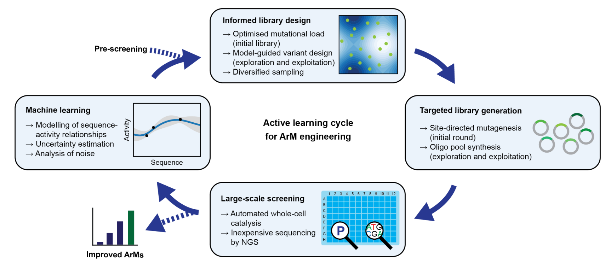

Content: Enhanced Sequence-Activity Mapping and Evolution of Artificial Metalloenzymes by Active Learning
--------

This repository contains scripts for analysis, preparation and reporting of results from a study published in  2024 ACS Central Science publication:



**Authors:** `Tobias Vornholt Mojmír Mutny, Gregor W. Schmidt, Christian Schellhaas, Ryo Tachibana,
Sven Panke, Thomas R. Ward, Andreas Krause, and Markus Jeschek`

**Title**: `Enhanced Sequence-Activity Mapping and Evolution of Artificial Metalloenzymes by Active Learning`

**Journal:** `ACS Central Science 2024`


For the full-paper please refer to the [link](https://www.biorxiv.org/content/10.1101/2024.02.06.579157v1.full.pdf). 

This repository containts:
- plotting scripts in `/plots`
- training scripts in `bechmark_run`
- sequential decision making scripts in `active_learning_X`

As part of the project we have developed a standalone python package `mutedpy`, which can be found in the dependecies section. 

Updates
-------
- 21/05/2024 Initial version of public code online 

Dependencies
------------
This repository contains only basic script which build upon libraries


   1. `mutedpy`  https://github.com/Mojusko/mutedpy

  2. `stpy` https://github.com/Mojusko/stpy


Further resources
-----------------
A large part of the dataset could not fit to the repository. Additional data is located in
1. Embeddings form the `/data` can be downloaded from [here](polybox).
2. NGS sequencing analysis can be downloaded from [here](https://polybox.ethz.ch/index.php/s/rBwi3FQXqQDSJEi). 
3. 10% subset of structured generated via Rosetta software. It can be downloaded [here](https://polybox.ethz.ch/index.php/s/aw0W3pjzpxuLSBl). 
4. Pretrained and saved models for the plotting can be found [here](polybox).


How setup the code?
--------------------
The easiest way to rerun the clode is to clone repository along with the stpy repository as

```bash
git clone https://github.com/Mojusko/mutedpy
cp /experiment/ 
git clone https://github.com/lasgroup/ml-protein-design-sav-gold 
mv ml-protein-design-sav-gold streptavidin
cd streptavidin 
wget https://polybox.ethz.ch/index.php/s/XKNUFIGRY08py63 #retrieve saved embeddings data 
unzip data.zip data
wget https://polybox.ethz.ch/index.php/s/Bd9bi0ITfBI6xur #retrieve save pickled models
uzip models.zip models
```

Rerunning analyses
-----------------
The benchmarking analysis can be rerun using the code in ` bechmark_run` sub-folder. Namely, the final parameters for the chemical features can be run with: 

```bash
cd experiments/streptavidin
mkdir results_strep
cd bechmark_run
mkdir job_files_exp
python benchmark_run/run_final_aa.py`
sh job_files_exp/job0.sh
```

The final model is then saved to to the `results_strep` subfolder along with plots of different cross-validation splits. To rerun the extensive benchmark access to our `MongoDB` database is needed. The code and calculation of structure is however available online. We used `benchmark_run/run_extra_analysis_bench_2.py` to generate hyperparameter for benchmarking. 

Plots
-----
The plots for the publication and statistical analysis can be found in the subfolder `plots/`. 

Citation
---------
To cite this work, please use 
`@Vornholt`

Authors & Contact
-------
This repository was assembled by Mojmir Mutny (ETH Zuerich) and Tobias Vornholt (ETH Zuerich and University of Basel).

For any inquries regarding the code, please use: `mmutny@inf.ethz.ch`
